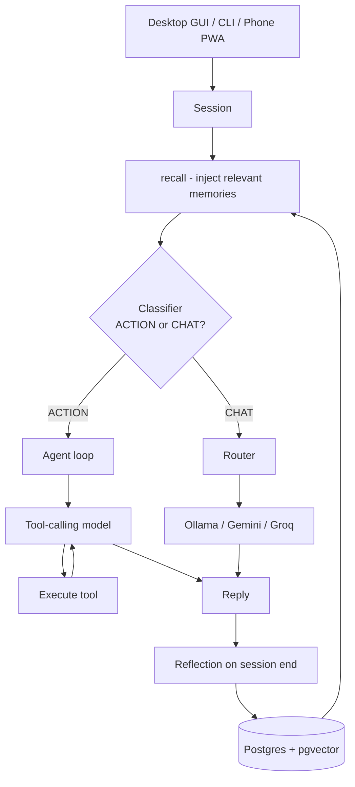

# SERENE

A local-first personal AI assistant that holds a conversation, remembers you across sessions, and can actually act on your computer — open apps, manage files, browse the web, control Spotify.

Runs on your own machine with a swappable "brain": a local model via Ollama, or Gemini/Groq when you want more capability.

```
You: what's in my downloads folder?
SERENE: You've got 3 PDFs, an installer, and a folder called "sem3".

You: put my todo list in a file on the desktop
SERENE: Done — saved it to todo.txt on your desktop.

You: i'm nervous about tomorrow
SERENE: The tennis match? You said you'd been practising all week.
```

That last line isn't scripted. It comes from the memory system.

---

## What makes it more than a chat wrapper

**It decides for itself whether to talk or act.** Every message is classified as `CHAT` or `ACTION` by a small, fast model before anything else happens. You never pick a mode.

**It remembers.** Conversations are distilled into durable facts and episode summaries, stored in Postgres with vector embeddings, and retrieved by hybrid search when relevant.

**It has hands.** ~32 tools across files, desktop automation, web, and Spotify — invoked through a tool-calling loop, not hardcoded commands.

**Three interfaces, one brain.** Desktop GUI, CLI, and an installable phone web app all share the same session logic.

---

## Architecture



**The request lifecycle:**

1. A message arrives at `Session.send()` — the same entry point regardless of interface.
2. `recall()` pulls relevant long-term memories and injects them into the system prompt.
3. A classifier (`llama-3.1-8b-instant`) labels the message `ACTION` or `CHAT`.
4. **CHAT** → the active brain, with the full personality prompt.
   **ACTION** → the agent loop, with a lean tool-focused prompt.
5. On session end, `reflect()` extracts durable facts and an episode summary, and writes them back to the database.

---

## The memory system

Memory is split into two tiers, because not everything deserves equal treatment.

| Tier | Behaviour |
|---|---|
| **Core** | Identity-level facts (name, key relationships). Always injected, never searched, never forgotten. |
| **Ambient** | Everything else. Surfaced only when relevant; decays over time. |

**Retrieval is hybrid.** A pure vector search blurs over exact names; a pure keyword search misses paraphrase. So both run, and results are merged with Reciprocal Rank Fusion — items ranked highly by either method surface, items ranked highly by both win.

```
semantic search (pgvector, HNSW, cosine)  ─┐
                                           ├─► RRF ─► top-k ─► system prompt
keyword search (Postgres FTS, GIN index)  ─┘
```

**Retrieval aims for recall, not precision.** Embeddings are good at "similar" and bad at associative leaps — `"I'm nervous about my game"` → `"plays tennis every Thursday"` is not a similarity relationship. So the retriever pulls a generous candidate set and lets the language model decide what's actually relevant when it replies. Filtering hard at the retrieval stage was measurably worse.

**Writes deduplicate.** A new fact matching an existing key updates it. Otherwise, only a very close vector match (distance < 0.10) is treated as the same fact — kept strict so `"name is Srikesh"` and `"Srikesh was born in..."` don't collapse into one.

**Forgetting is deliberate.** Stale, low-importance ambient facts are pruned after 45 days, and both tables are capped. Core memory is never touched.

**Stack:** `BAAI/bge-small-en-v1.5` (384-dim, runs locally) · Postgres + pgvector · HNSW index for vectors, GIN for full-text.

---

## Design decisions worth explaining

**Tiered models, matched to task difficulty.** Four different models, each chosen for the property the job needs — not for raw capability:

| Job | Model | Why |
|---|---|---|
| Classify chat vs action | `llama-3.1-8b-instant` | On the hot path for every message. Latency matters more than intelligence; the task is easy. |
| Tool calling | `gpt-oss-20b` | Emits proper structured function calls. Llama's text-tag format was unreliable to parse. |
| Chat | configurable | Quality matters; latency is tolerable. |
| Memory extraction | `llama-3.3-70b` | Must produce strict, parseable JSON. |

**Two personality prompts.** The chat persona is long and detailed. Feeding it to the tool-calling model measurably degraded its ability to emit valid function calls, so the action path gets a short, lean prompt instead. Personality where it helps, precision where it matters.

**The classifier fails toward `CHAT`.** If the API errors, the system guesses "just talking." The failure modes aren't symmetric: guessing CHAT wastes a turn, while guessing ACTION points a model with filesystem access at a message that couldn't even be classified. When forced to guess, guess toward the reversible outcome.

**Tools self-register.** A `@tool` decorator records both the JSON schema sent to the model and the Python function to execute, in one place. Adding a capability is writing a function and decorating it — no central list to drift out of sync.

```python
@tool("list_dir", "List files in a folder.",
      {"path": {"type": "string", "description": "Folder to list."}},
      required=["path"])
def list_dir(path):
    ...
```

**Bounded blast radius.** The agent loop caps at 5 steps so a confused model can't loop forever. File operations are restricted to a configured root directory. Destructive actions route through a confirmation layer.

---

## Setup

**Requires:** Python 3.10+, PostgreSQL with the `pgvector` extension, and [Ollama](https://ollama.com) if you want a local brain.

```bash
git clone https://github.com/srikesh2654/personal-ai-assistant
cd personal-ai-assistant
python -m venv .venv && .venv\Scripts\activate
pip install -r requirements.txt
```

Create a `.env`:

```env
GROQ_API_KEY=your_key
GEMINI_API_KEY=your_key
DB_URL=postgresql://user@127.0.0.1:5432/serene
ALLOWED_ROOT=C:\Users\you
ACTIVE_BRAIN=local

# optional — override any model
GROQ_MODEL=llama-3.3-70b-versatile
LOCAL_MODEL=llama3.2
AGENT_MODEL=openai/gpt-oss-20b
```

Then:

```bash
python main.py              # desktop GUI
python -m serene.cli        # terminal
python -m serene.server     # phone server on :8765
```

For the phone app, open `http://<your-pc-ip>:8765` on a device on the same network and install it as a PWA.

---

## Project structure

```
serene/
├── session.py       # conversation logic — shared by all three interfaces
├── classifier.py    # chat vs action routing
├── agent.py         # the tool-calling loop
├── router.py        # swappable brains
├── reflection.py    # end-of-session memory extraction
├── persona.py       # system prompts
├── memory/
│   ├── db.py        # schema, pgvector setup, indexes
│   ├── embedder.py  # local sentence-transformer
│   ├── store.py     # writes, dedup, decay
│   └── recall.py    # hybrid retrieval + RRF
├── tools/
│   ├── registry.py  # @tool decorator, dispatch
│   ├── files.py     # filesystem operations
│   ├── desktop.py   # window control, clicking, typing
│   ├── web.py       # browser automation
│   ├── spotify.py   # playback control
│   └── safety.py    # path restrictions, confirmations
├── gui.py           # desktop interface
├── cli.py           # terminal interface
└── server.py        # FastAPI + phone PWA
```

---

## Known limitations

Being honest about what isn't solved:

- **Reference resolution is a recency heuristic.** The classifier sees the last 4 messages to resolve "it" and "that file." If the referenced thing scrolled out of that window, it misclassifies. The right fix is tracking the last-acted-on entity as explicit state rather than re-reading conversation history.
- **The phone server auto-approves confirmations**, because tool dialogs can't reach a remote client yet. Confirmations should route to the phone as a yes/no message.
- **Single-user by design.** Tokens are stored in memory and there's one global session.
- **No type hints or test suite yet.** Both are next.

---

Built by [Srikesh K](https://github.com/srikesh2654).
